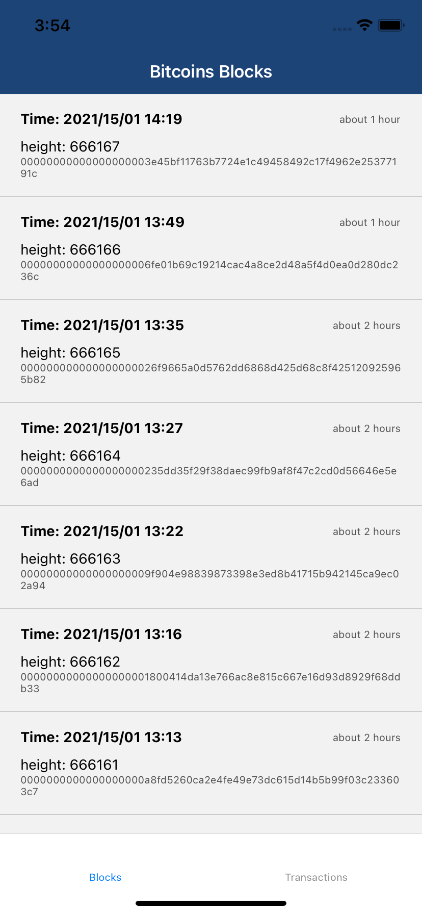
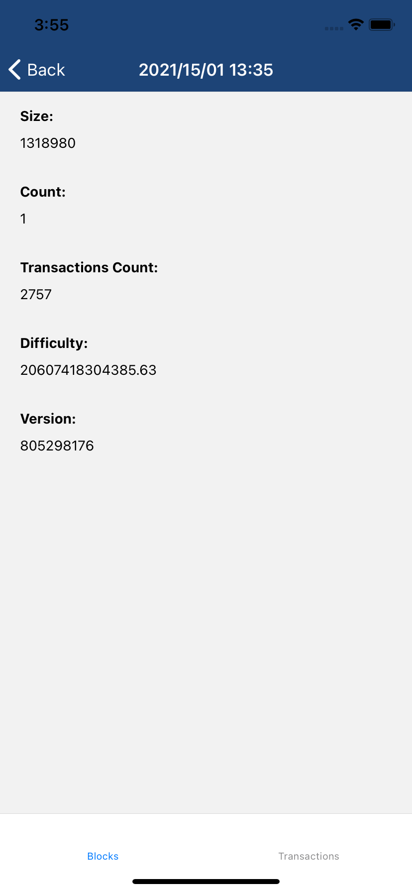
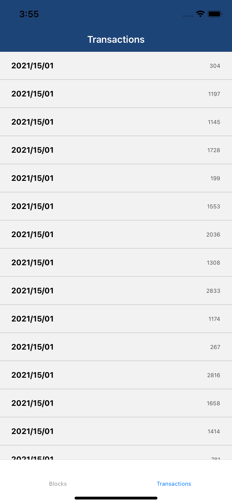

# Bitwase React Native app 
Basic use case of qraphql using `https://graphql.bitquery.io` as an endpoint.
Core libraries:
- React Native https://reactnative.dev/docs/environment-setup
- React Navigation https://reactnavigation.org/docs/getting-started
- Apollo https://www.apollographql.com/docs/react/get-started/
- date-fsn https://date-fns.org/v2.16.1/docs/Getting-Started

## Installation
If you have yarn and MacOS run:
```
make init
```
When that is over I usually open separate terminal window and run `yarn start --verbose` (`--verbose` is optional) to monitor better hotreload process
After that the app can be run 
```
yarn ios
```
or
```
yarn android
```
Or if you are using Windows or you don�t have yanr the installation needs to be done in this way:
```
npm install
npx pod-install
npx react-native run-ios
```
this is recommended by React Native setup documentation

I prefer iOS as development environment (for now this app is only tested on iOS)

## Screenshots




## Known Issues
- [ ] there is cache and and merging new incoming data is not implemented
- [ ] auto refresh is not handled if transaction query fails

## Small easy to fix tasks
- [ ] make file to test if yarn is installed
- [ ] add maintenance for android build
- [ ] dark theme

## Recommendations for further development of the project
- Design recommendations:
    - UX mockups using a design software (I prefer Adobe XD)
    - Integration of animation library if the design team can provide animations
    - Accessibility needs to be accounted for
        - dark/light theme preference
        - color blindness consideration
        - different motion preferences
        - different transparency preferences
        - using the device with unconventional methods
            - keyboard, mouse, switch control
            - voice control, 
        - usability screens
            - widgets
            - context menu
            - apple Watch companion App
            - Siri shortcuts
- implementation of tests
    - mocking up server, I recommend Docker
    - UI test
    - Accessibility test
        - motion
        - readability of content
        - usability (button size and location)
 - Integration tests
    - the project has to be prevented from going to production if the app is not usable 
- translations implementation
    - have to be discussed and decided on translation system
    - I recommend creation tools for the translators
- common module for the communication
